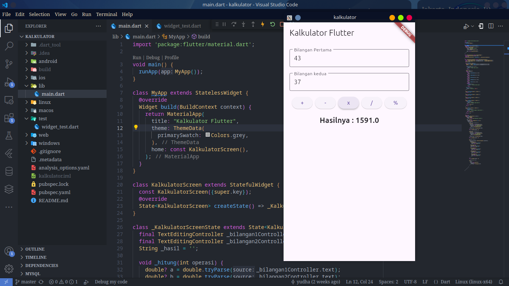
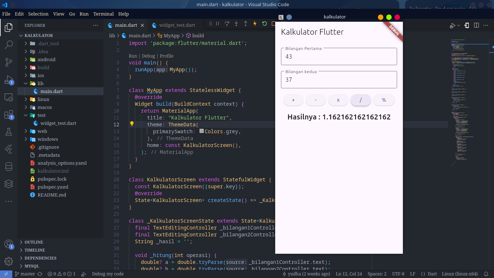

<h1 align="center">🧮 Ivul Calculator</h1>
 Aplikasi kalkulator sederhana yang dibangun menggunakan <strong>Flutter</strong>. Aplikasi ini mendukung operasi dasar seperti penjumlahan, pengurangan, perkalian, pembagian, dan modulus. 🚀 

🌟 Fitur

    ➕ Penjumlahan: Menghitung hasil penjumlahan dua bilangan.

    ➖ Pengurangan: Menghitung hasil pengurangan dua bilangan.

    ✖️ Perkalian: Menghitung hasil perkalian dua bilangan.

    ➗ Pembagian: Menghitung hasil pembagian dua bilangan.

    ⚙️ Modulus: Menghitung sisa hasil bagi dua bilangan.

🛠️ Teknologi yang Digunakan

    Flutter: Framework untuk membangun aplikasi mobile cross-platform.

    Dart: Bahasa pemrograman yang digunakan untuk mengembangkan aplikasi Flutter.

🚀 Cara Menjalankan

1. Persiapan.  
Pastikan Anda telah menginstal Flutter dan Dart di perangkat Anda. Jika belum, ikuti panduan instalasi di flutter.dev.

2. Clone Repositori
   Clone repositori ini ke lokal Anda:
   
        bash Copy

        git clone https://github.com/Platotel3s/Ivul_Calculator.git

 
3. Instal Dependencies
    Masuk ke direktori proyek dan jalankan perintah berikut untuk menginstal dependencies:

    bash Copy

    flutter pub get
 
4. Jalankan Aplikasi

Jalankan aplikasi di perangkat atau emulator Anda:
    
    bash Copy

    flutter run

📸 Screenshot
    Contoh visual Aplikasi Ivul Calculator, bisa dilihat pada gambar di bawah ini

       
      
      
      
      

 
🌟 Manfaat dan Kelebihan
Manfaat

    🧮 Mudah Digunakan: Antarmuka yang sederhana dan intuitif.

    📱 Cross-Platform: Dapat dijalankan di Android, iOS, dan web.

    ⚡ Cepat dan Ringan: Dibangun dengan Flutter, aplikasi ini ringan dan responsif.

Kelebihan

    🔧 Open Source: Kode sumber terbuka untuk dipelajari dan dikembangkan lebih lanjut.

    🛠️ Dukungan Komunitas: Flutter memiliki komunitas yang besar dan aktif.

    📊 Fitur Lengkap: Mendukung operasi matematika dasar yang sering digunakan.

🤝 Kontribusi

Jika Anda ingin berkontribusi pada proyek ini, silakan ikuti langkah-langkah berikut:

    Fork repository ini.

    Buat branch baru:
    bash
    Copy

    git checkout -b fitur-baru

    Commit perubahan Anda:
    bash
    Copy

    git commit -m "Menambahkan fitur baru"

    Push ke branch:
    bash
    Copy

    git push origin fitur-baru

    Buat pull request.

📜 Lisensi

Proyek ini dilisensikan di bawah MIT License.

👨‍💻 Tim Pengembang
    Syaiful Yudha Platoteles : 
      - 🚀 Project Lead
      - 🖥️ Developer
      - 🎨 UI/UX Designer

Dengan Ivul Calculator ini, kami berharap dapat memberikan solusi sederhana untuk perhitungan matematika sehari-hari. Terima kasih telah menggunakan aplikasi ini! 😊
